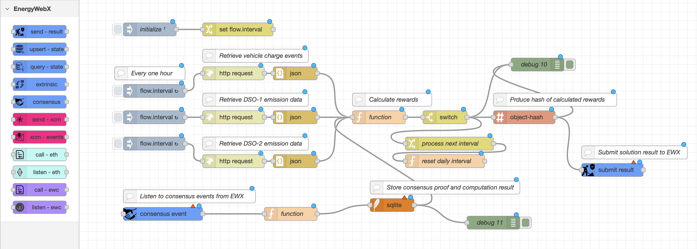

# node-red-contrib-energywebx
Have your node-red flows to become SmartFlows by being installed, executed and reach consensus across thousands of decentralised worker nodes around the world.

Screenshot:

## Nodes
**Submit Results**
- Sends the computation result to EWX with configured solution namespace and network(REX, EWX)

**Consensus Event**
- Listens to consensus event raised from particular solution on EWX (upon majority of worker nodes publish their result), this includes consensus proof hash and corrsponding block hash

**Upsert State (WIP)**
- Worker node casts a vote(request) to update state of a partucular object attached to a solution on EWX

**Query State (WIP)**
- Worker node makes a call to a particular solution object store in order to retrieve the current value

**Send XCM (WIP)**
- Sends a request XCM message publishing, upon majority votes by all worker nodes, this will be trigered on EWX to a target parachain and pallet

**Listen XCM (WIP)**
- Listens to particular XCM events recieved on EWX from a source parachain pallet

**Eth Interaction (WIP)**
- Request for an interaction with a particular SmartContract on main-net Ethereum

**Eth Events (WIP)**
- Listens to a particular event raised from a target SmartContract on main-net Ethereum

**EWC Interaction (WIP)**
- Request for an interaction with a particular SmartContract on Energy Web Chain

**EWC Events (WIP)**
- Listens to a particular event raised from a target SmartContract on Energy Web Chain
